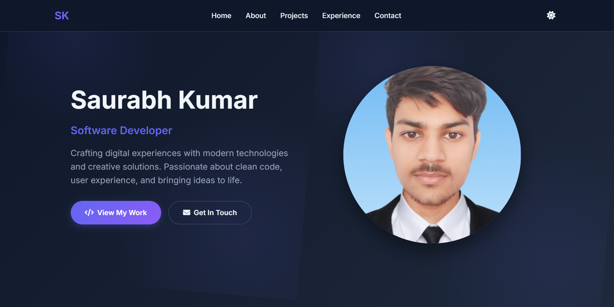
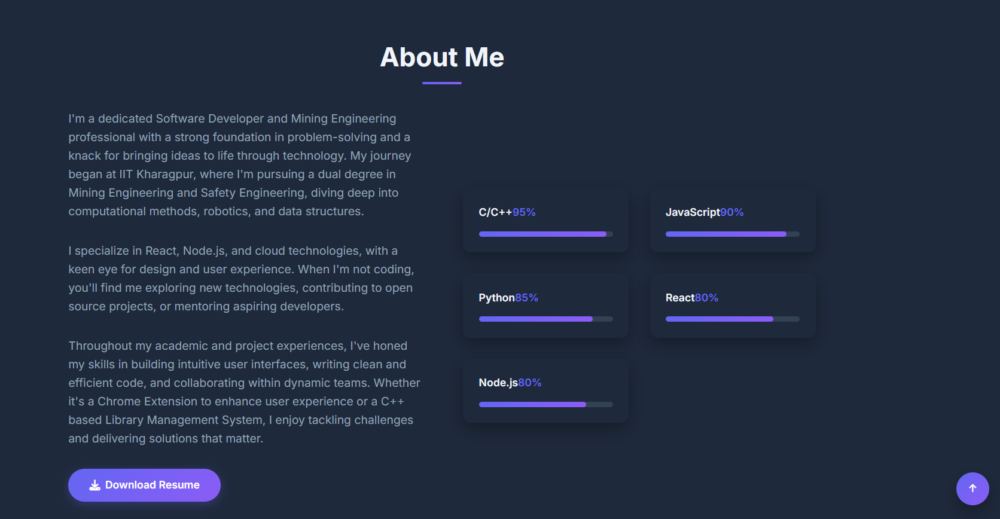
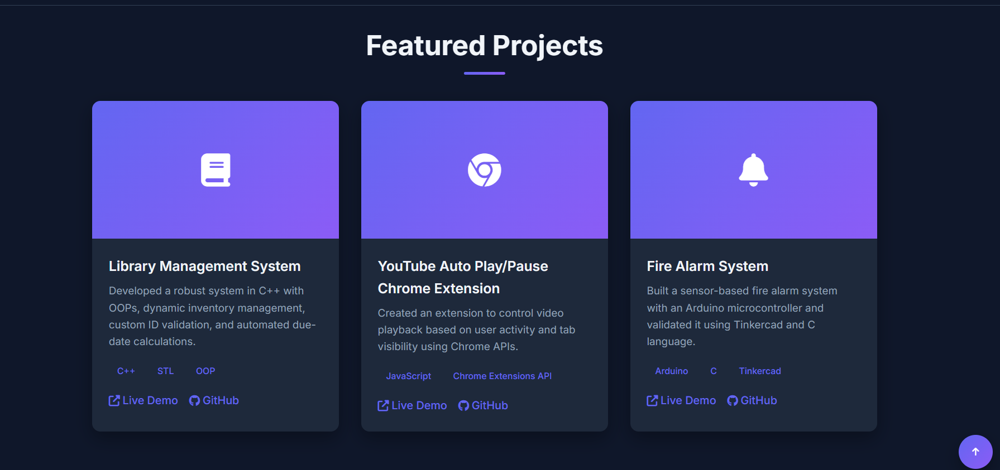
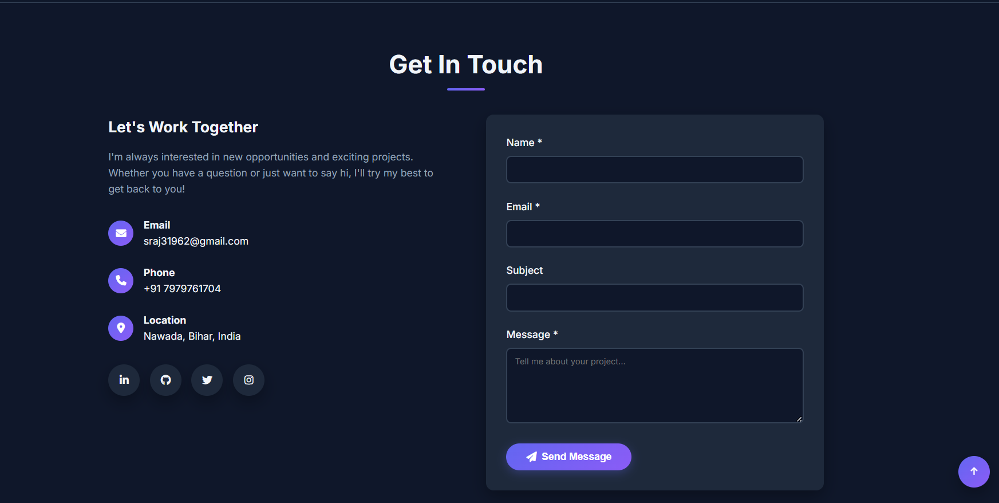

# 🌟 Saurabh Kumar - Developer Portfolio

This is my personal portfolio website showcasing my projects, experience, and skills as a software developer and mining engineering professional. Built with modern web technologies, it serves as a digital portfolio to present my work and connect with collaborators, recruiters, and fellow developers.

---

## 🚀 Live Demo

👉 [Visit Portfolio](https://your-live-portfolio-link.com)  

---

## 📌 Features

✅ **Dynamic Landing Page**  
✅ **Dark/Light Theme Toggle**  
✅ **Responsive Design**  
✅ **Typing Animation for Role**  
✅ **Smooth Scroll Navigation**  
✅ **Animated Skills Section**  
✅ **Interactive Project Cards**  
✅ **Contact Form**  
✅ **Downloadable Resume**  
✅ **Social Media Links**

---

## 🛠️ Tech Stack

- **HTML5**  
- **CSS3 (Flexbox, Grid, Animations)**  
- **JavaScript (ES6+)**  
- **Font Awesome Icons**  
- **Google Fonts**  

---

## 💡 Projects Highlighted

- **Library Management System** (C++)  
  A robust system built using OOP principles, featuring dynamic inventory management and custom ID validation.

- **YouTube Auto Play/Pause Chrome Extension**  
  Automates video control based on tab visibility using the Chrome Extensions API.

- **Fire Alarm System**  
  A sensor-based alert system built with Arduino and C for detecting fire hazards.

---

## 🎨 Screenshots

>   
>   
>   
> 

---

## 📂 Folder Structure
> assets
> screenshots
> files --- |index.html
            |style.css
            |index.js
